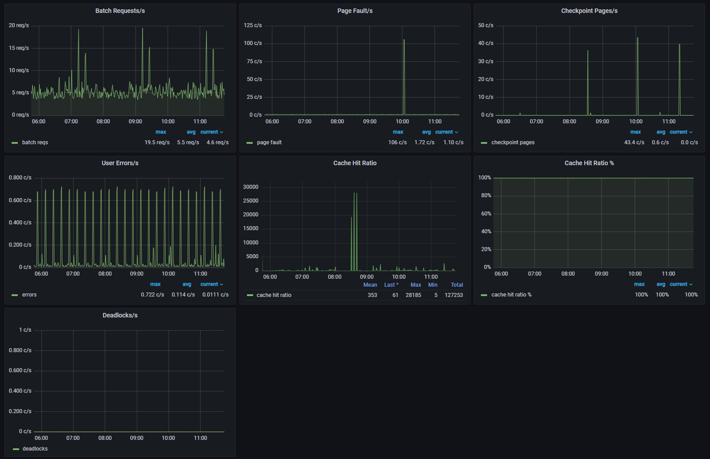
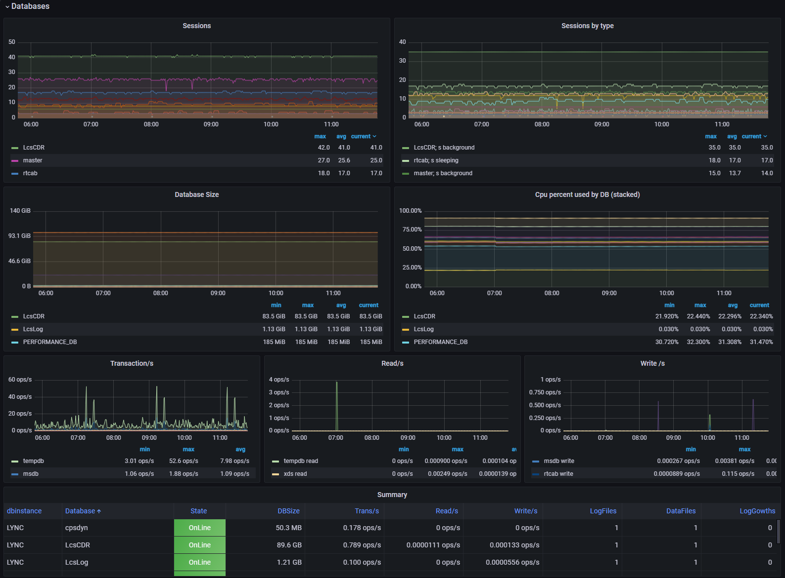
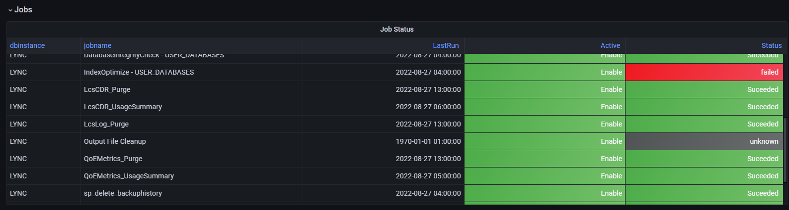

# Dashboard Screenshots

## Overview: System Informations

Uptime, Sessions, CPU, Mem

## Details 

CacheHit Ratio; Batch Requests Errors... 

## Databases info

Status, Sessions, Cpu, Size, transactions...

## Jobs

